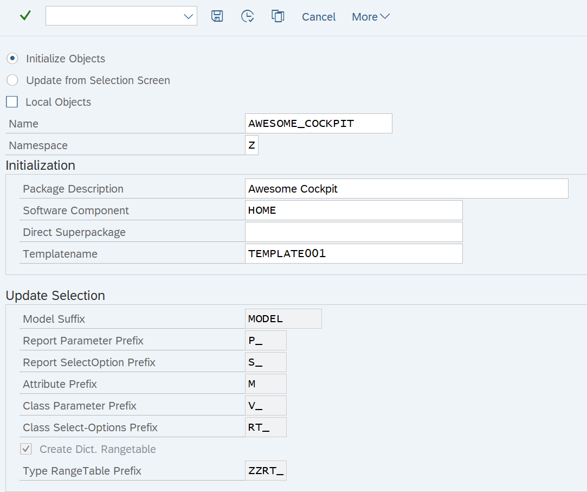
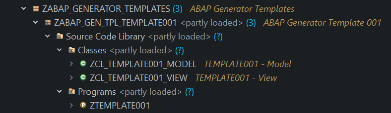
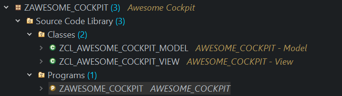
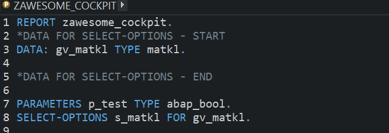
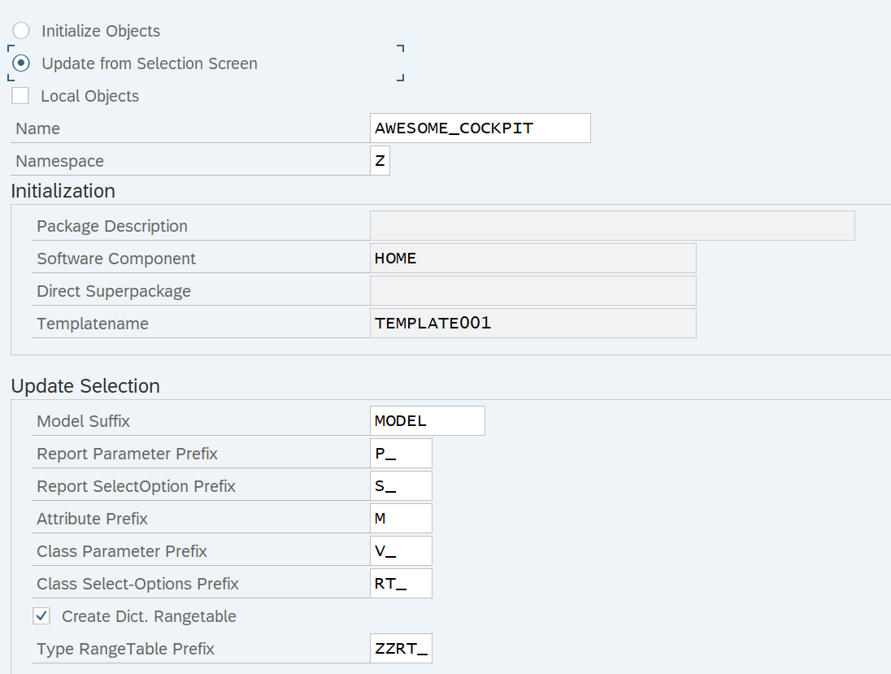
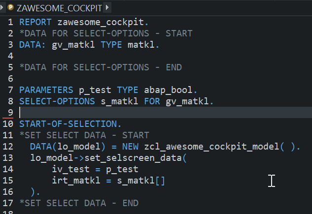
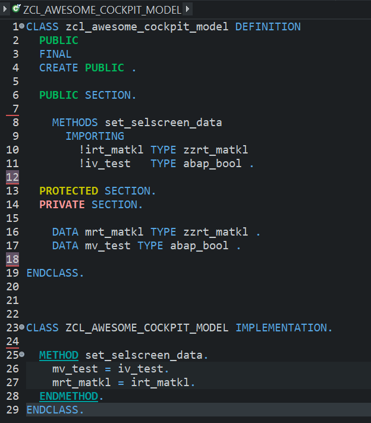

# AbapGenerator
Generate ABAP Objects from Templates

ABAP Generrator is a Framework to generate Packages, Programms, Classes from a Template.

Use-Case:
If you use a Design Pattern like Model-View-Controller, you always have to create a lot of Object for a new Project.
You create a Package, a Report, a Model-Class, a View-Class and maybe other Classes.
There is also the hassle to pass the Selection Screen Data from the Report to the Model Class.

With ABAP Generator:
- You create your Template Packages with your needed Classes and one Report once
- When you want to start a new Project you just start Transaction ZABAP_GENERATOR with your Template
- Initialization (in ZABAP_GENERATOR)
  - The Template Objects will be copied and changed accordingly (Templatename will be replaced with the Projectname)  
- You change your created Report Selection Screen as you like in ADT or SE38
- Update Selection Screen (in ZABAP_GENERATOR)
  - Your Report Selection Screen will be read and the Parameters/Select-Options passed to the Model Class
  - Model Class will be changed to fit the Selection Data
  - If Dict. Range Tables is checked TableTypes with Rangetables will be created if not already available.

You can change the Default Values in Table ZZT_ABAP_GEN with SM30

Transaction ZABAP_GENERATOR Initialization:

Template Package:

New Package:

Update Report as you like:

Transaction ZABAP_GENERATOR Update:

Updated Report:

Updated Model:

